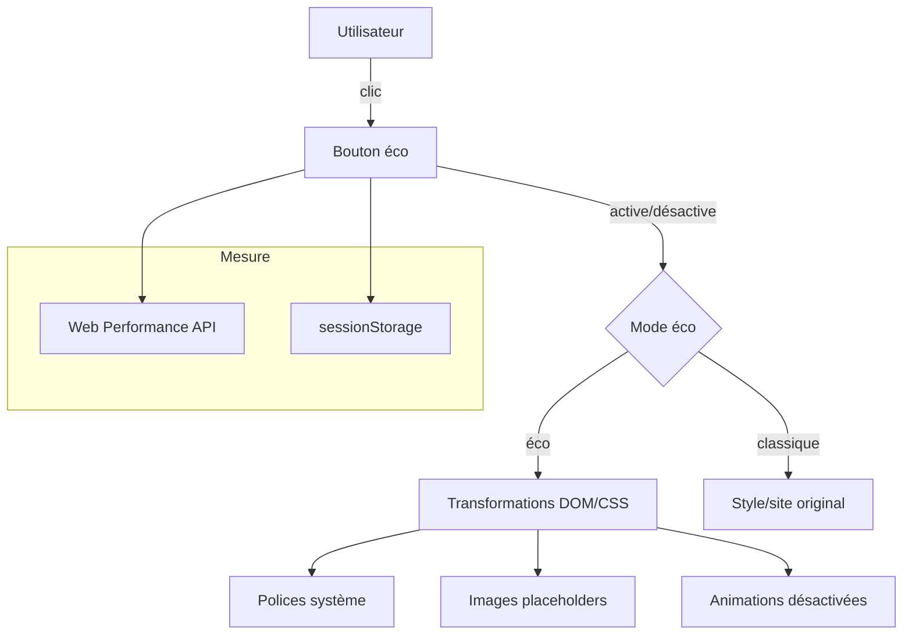

### 1. En-tête & Introduction

# Bouton Écoresponsable — Widget de navigation sobre pour le web


> Un geste pour la nature : basculez votre site en mode éco-responsable en un clic.

Bouton Écoresponsable est un widget JavaScript léger (≈5 KB) qui permet aux sites web de proposer une expérience de navigation sobre. En activant le mode éco, il applique instantanément des transformations pour réduire l’empreinte carbone des pages: polices système, images simplifiées, animations désactivées et éléments décoratifs retirés. L’utilisateur reste maître de son expérience tout en contribuant à la sobriété numérique.

Principaux cas d’usage:

- Réduire l’impact environnemental de la navigation web (-70% poids moyen des pages, jusqu’à 3x plus rapide).
- Sensibiliser les utilisateurs à leur consommation numérique avec des indicateurs en temps réel.
- Intégrer une solution plug & play (NPM ou CDN) sans refactor massif.
- Mesurer et afficher les économies réalisées (bande passante, CO₂ estimé).

### 2. Table des matières

- [Contexte & Objectifs](#3-contexte--objectifs)
- [Architecture & Technologies](#4-architecture--technologies)
- [Installation & Prérequis](#5-installation--prérequis)
- [Utilisation](#6-utilisation)
- [Configuration](#7-configuration)
- [API / Documentation technique](#8-api--documentation-technique)
- [Tests & Qualité](#9-tests--qualité)
- [Contribuer](#10-contribuer)
- [Roadmap & TODO](#11-roadmap--todo)
- [Communauté & Support](#12-communauté--support)
- [Licence](#13-licence)
- [Références & Inspirations](#14-références--inspirations)

### 3. Contexte & Objectifs

Le numérique représente près de 4% des émissions mondiales de CO₂ et sa part croît chaque année. Face à cet enjeu, Bouton Écoresponsable propose une approche pragmatique et actionnable pour réduire l’empreinte des sites web sans sacrifier l’accessibilité ni la compatibilité.

Objectifs clés:

- Réduire l’impact environnemental en un clic grâce à des transformations non destructives.
- Sensibiliser les utilisateurs à la sobriété numérique via des métriques visibles.
- Permettre une intégration simple (NPM ou CDN) et une adoption rapide.
- Offrir un socle mesurable pour suivre les économies de bande passante et d’émissions.

Audience visée:

- Développeurs front-end et full-stack, designers et product managers.
- Entreprises souhaitant aligner leur stratégie RSE et leur présence web.
- Établissements d’enseignement, chercheurs et collectivités engagées dans le Green IT.

Différenciateurs:

- Activation/désactivation instantanée par l’utilisateur, sans perte de fonctionnalité.
- Fonctionne sur des sites existants sans refonte (auto-injection du bouton dans la navigation).
- Approche mesurable: APIs de Performance Web pour estimer le poids et les transferts.
- JavaScript vanilla, faible empreinte, aucune dépendance lourde.

### 4. Architecture & Technologies

Stack technique:

- Langage: JavaScript (vanilla), export `ES Module`.
- Plateformes d’intégration: NPM, CDN.
- APIs navigateur: `Performance`, `PerformanceResourceTiming`, `sessionStorage`.

Schéma d’architecture simplifié:



Organisation du code:

- `eco.js`: classe `EcoButton` exportée par défaut; gère l’injection du bouton, le basculement de mode, les transformations, et la mesure de la bande passante.

### 5. Installation & Prérequis

Prérequis:

- Navigateur moderne (support de `PerformanceResourceTiming`).
- Optionnel: Node.js ≥ 16 si usage NPM.

Installation via NPM:

```bash
npm install @cyde/bouton-eco
```

Intégration via CDN (plug & play):

```html
<script src="https://cdn.cyde.fr/bouton-eco.min.js"></script>
```

Exécution minimale (CDN):

```html
<div class="eco-btn-container"></div>
<script>
  // Le script CDN expose EcoButton en global
  new EcoButton({ trackMetrics: true });
  // Le bouton s’ajoute automatiquement dans .eco-btn-container
</script>
```

Exécution minimale (NPM / bundler):

```js
import EcoButton from "@cyde/bouton-eco";

new EcoButton({ trackMetrics: true });
```

### 6. Utilisation

Guide rapide:

1. Ajoutez un conteneur dans votre layout: `<div class="eco-btn-container"></div>` (ou configurez l’insertion dans votre navbar existante).
2. Chargez le script (NPM ou CDN) et instanciez `EcoButton`.
3. L’utilisateur peut basculer à tout moment entre mode classique et mode éco.

Commandes/Interactions principales:

- Clic sur le bouton: `toggleMode()` active/désactive le mode éco et enregistre l’état dans `sessionStorage` (`eco-mode`).
- Icône de rechargement: s’affiche après bascule pour recharger la page et appliquer partout les transformations.

Démo rapide (exemple visuel suggéré):

- Mode Classique: polices personnalisées, images HD, animations.
- Mode Éco: polices système, placeholders pour les images, animations désactivées, éléments décoratifs supprimés.

Cas d’usage typiques:

- Sites médias et e-commerce pour réduire le poids des pages en mobilité.
- Portails institutionnels cherchant une option de navigation sobre.
- Plateformes éducatives souhaitant sensibiliser et offrir le choix aux apprenants.

### 7. Configuration

Variables et options (objet passé au constructeur):

- `compressedImagesPath` (string, défaut: `images/eco`): répertoire des images compressées/placeholder.
- `uncompressedImagesPath` (string, défaut: `images/default`): répertoire des images d’origine.
- `fontsPath` (string, défaut: `""`): répertoire des polices personnalisées si utilisées.
- `useCustomFonts` (boolean, défaut: `false`): active l’usage de polices personnalisées.
- `onModeChange` (function, défaut: `null`): callback invoqué lors d’un changement de mode.

Paramètres additionnels et comportement:

- Persistance: `sessionStorage['eco-mode']` conservé entre pages.
- DOM requis: un conteneur `.eco-btn-container` présent dans la page.
- Mesure: calcul du poids total via `performance.getEntriesByType('resource')` et affichage possible dans `.bandwidth-info`.

Exemple de configuration:

```js
new EcoButton({
  compressedImagesPath: "images/eco",
  uncompressedImagesPath: "images/default",
  useCustomFonts: false,
  onModeChange: (enabled) => console.log("Mode éco:", enabled),
});
```

### 8. API / Documentation technique

Classe principale: `EcoButton`

- `constructor(options)`: instancie le bouton et l’insère dans `.eco-btn-container`.
- `toggleMode(evt?)`: bascule le mode, met à jour `sessionStorage`, insère une icône de rechargement.
- `beforeLoad()`: applique les transformations dès le chargement DOM en fonction du mode courant.
- `insertLink(path)`: insère dynamiquement une feuille de style dans `<head>`.
- `calculatePageWeight()`: calcule le poids total transféré des ressources.
- `saveTotalWeight()`: persiste le poids total en session.
- `displayBandwidthInfo()`: écrit l’état/poids dans `.bandwidth-info` si présent.
- `webConsumption()`, `getNetworkMeasure()`, `getResourcesMeasure()`, `getNetworkAndDataMeasure()`: utilitaires de métriques basés sur l’API Performance.


### 9. Tests & Qualité

Lancement des tests:

- À ce stade, aucune suite de tests automatisés n’est fournie. Recommandation: Jest/Vitest + Playwright pour e2e.

Couverture:

- Badge et rapport de couverture à venir après mise en place de la CI.

Qualité & CI/CD (recommandations):

- Linters: ESLint + Prettier.
- CI: GitHub Actions pour lint, build, tests et publication sur npm.

### 10. Contribuer

Nous accueillons les contributions avec plaisir!

Processus proposé:

1. Forkez le dépôt et créez une branche (`feat/ma-fonctionnalite`).
2. Commitez des edits atomiques et documentés.
3. Ouvrez une Pull Request avec description, captures ou GIF si pertinent.

Règles de style:

- Nommage explicite, code lisible, fonctions courtes.
- Pas d’inline comments superflus; privilégier des docstrings concises.

### 12. Communauté & Support

Canaux officiels:

- Site: `https://cyde.fr`
- LinkedIn `https://fr.linkedin.com/company/cyde-sas`

Mainteneurs:

- Équipe Cyde — cyde.fr


### 14. Références & Inspirations

- Green IT, éco-conception web, sobriété numérique.
- Web Performance API (MDN): `https://developer.mozilla.org/docs/Web/API/Performance`
- Exemples et bonnes pratiques d’intégration via widgets front-end.

—

Si vous utilisez Bouton Écoresponsable dans votre produit, dites-le-nous: vos retours aident à prioriser la roadmap et à maximiser l’impact environnemental positif.
